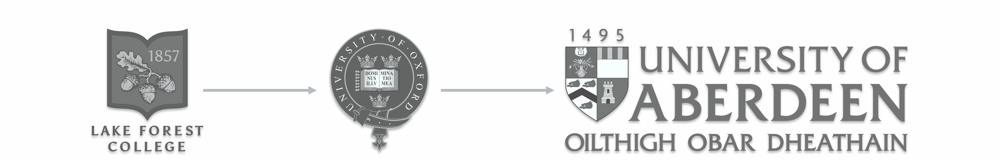

```{r setup, include=FALSE}
knitr::opts_chunk$set(echo = TRUE)
```


---

<br>

<center>


</center>

<br>

### Samuel Gascoigne | Research Fellow | University of Aberdeen

<br>

<style>
body {
text-align: justify;
font-size: 12pt;
}

h2, h3 {
  text-align: center;
}
</style>


---

<br>

## Brief Introduction

<br>

**I am a population ecologist with broad interests in eco-evolutionary dynamics.** Currently, I am particularly interested in (1) how populations respond to variable environments and (2) how population's evolve to accommodate the impacts of changing environments. To address these topics, I have an interdisciplinary research program including the humble fruit fly (*Drosophila melanogaster*) for more proximate (mechanistic) questions and structured population models (*i.e.*, matrix population models and integral projection models) for more ultimate (evolutionary) questions.

I received my undergraduate degrees in Biology and Neuroscience from Lake Forest College. At LFC, I gained a passion for research at the intersection of ecology and evolution by working with [Dr. Alexander Shingleton](http://www.shingletonlab.org) on the physiological mechanisms behind plastic morphological traits in *Drosophila melanogaster*  and [Dr. Flavia Barbosa](https://sites.google.com/view/barbosalab/home?authuser=0) on the structure of life-history trait hierarchies and covariances in *Callosobruchus maculatus*. After my undergrad, I began a DPhil in Biology at the University of Oxford advised by [Dr. Roberto Salguero-Gómez](https://www.salgo.ox.ac.uk/people/dr-rob-salguero-gomez) and [Dr. Irem Sepil](https://www.biology.ox.ac.uk/people/dr-irem-sepil) where I researched the impacts of variable environments on population dynamics and life history evolution. In addition to my DPhil, I helped grow, curate and do outreach for the [COMPADRE and COMADRE databases](https://compadre-db.org).

After my DPhil, I am excited to say I have started a research fellowship with [Dr. Greta Bocedi](https://gretabocedi.com) at the University of Aberdeen, as well as research groups across Aarhus University and University of Helsinki, in the Novo Nordisk funded [Centre for Ecological Genetics](https://bio.au.dk/forskning/forskningscentre/centre-for-ecological-genetics/people). Our work is focused on (1) quantifying the impact of genetic structure on extinction risk across arthropod species in Denmark and (2) building new theory linking life-history evolution, dispersal ecology and population genetics to better understand *how* and *why* populations do or don't persist in a changing world.

<br>

<center>



</center>

<br>

---

