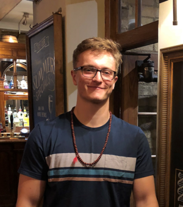

```{r setup, include=FALSE}
knitr::opts_chunk$set(echo = TRUE)
```

<br>

<center>



</center>

<br>

<style>
body {
text-align: justify}
</style>

I am a population ecologist with broad interests in eco-evolutionary dynamics. Currently, I am particularly interested in (1) how populations respond to variable environments and (2) how population's evolve to accommodate the impacts of changing environments. To address these topics, I have an interdisciplinary research program including the humble fruit fly (*Drosophila melanogaster*) for more proximate (mecahanistic) questions and structured population models (*i.e.*, matrix population models and integral projection models) for more ultimate (evolutionary) questions.

I am currently a DPhil student at the University of Oxford advised by [Dr. Roberto Salguero-Gómez](https://www.salgo.ox.ac.uk/people/dr-rob-salguero-gomez) and [Dr. Irem Sepil](https://www.biology.ox.ac.uk/people/dr-irem-sepil). In addition to my DPhil, I help grow, curate and do outreach for the [COMPADRE and COMADRE databases](https://compadre-db.org).

After my DPhil, I am excited to say I will start a research fellowship with [Dr. Greta Bocedi](https://gretabocedi.com) at the [University of Aberdeen](https://www.abdn.ac.uk), as well as research groups across [Aarhus University](https://international.au.dk) and [University of Helsinki](https://www.helsinki.fi/en), in the Novo Nordvisk funded [Centre for Ecological Genetics](https://bio.au.dk/forskning/forskningscentre/centre-for-ecological-genetics/people). Our work will be focused on (1) quantifying the impact of genetic structure on extinction risk across arthropod species in Denmark and (2) building new theory linking life-history evolution, dispersal ecology and population genetics to better understand *how* and *why* populations do or don't persist in a changing world.
